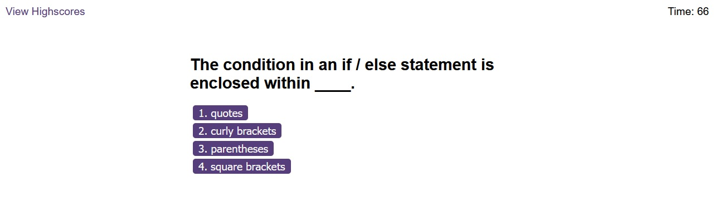

# coding-quiz

This coding quiz presents the user with five questions about coding. It includes a timer which starts at 75 seconds and will lose 15 seconds after each incorrect answer. If the timer reaches 0, the quiz ends. The user's score = the value of the timer after finishing the last quiz question. The user may save their initials and score.

https://nookworth.github.io/coding-quiz/

